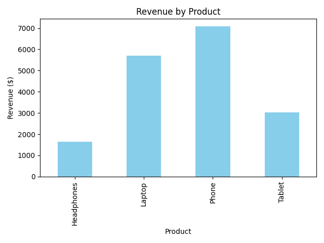

# 📊 Sales Summary Analysis (SQLite + Python)

## 📌 Project Overview
This project demonstrates how to use **SQLite** as a lightweight database and analyze sales data with **Python** inside JupyterLab.  
The goal is to generate a **sales summary** by product, calculate revenue, and visualize results.  

By combining SQL queries with Python’s analytical libraries, the project shows how raw transactional data can be turned into **business insights**.

---

## 🛠️ Tech Stack
- **Database**: SQLite (embedded, no server required)  
- **Programming**: Python 3  
- **Libraries**:  
  - `sqlite3` (database connection)  
  - `pandas` (data analysis)  
  - `matplotlib` (data visualization)  
- **Environment**: JupyterLab  

---

## 📂 Project Structure
sales_summary/
├─ data/
│ └─ sales_data.db # SQLite database file
├─ results/
│ ├─ sales_chart.png # Revenue by product chart
│ └─ summary_output.txt # Sales summary table
├─ sales_summary.ipynb # Jupyter notebook (full workflow)
└─ README.md

---

## 🚀 Workflow
1. **Database Creation**  
   - A new SQLite database `sales_data.db` is created.  
   - A `sales` table is populated with sample data (products, quantities, prices).  

2. **SQL Query Execution**  
   - Aggregates total quantity and revenue per product using:  
     ```sql
     SELECT product,
            SUM(quantity) AS total_qty,
            SUM(quantity * price) AS revenue
     FROM sales
     GROUP BY product;
     ```

3. **Result Export**  
   - Summary is saved as `results/summary_output.txt`.  

4. **Visualization**  
   - A bar chart of revenue by product is generated and saved as `results/sales_chart.png`.  

---

## 📈 Example Output

### 🔹 Sales Summary Table
| Product     | Total Quantity | Revenue ($) |
|-------------|----------------|-------------|
| Laptop      | 7              | 5,950       |
| Phone       | 14             | 7,080       |
| Tablet      | 10             | 3,100       |
| Headphones  | 35             | 1,525       |

### 🔹 Revenue by Product (Bar Chart)  


---

## 💡 Key Insights
- Phones generated the **highest revenue**, followed closely by laptops.  
- Headphones had the **largest sales volume**, but due to lower price, revenue contribution was smaller.  
- Tablets were moderate in both volume and revenue.  

---

## 🏆 Learning Outcomes
- Building and managing an SQLite database with Python.  
- Writing SQL queries (`SUM`, `GROUP BY`) inside Python.  
- Exporting query results to external files.  
- Creating simple but effective visualizations with Matplotlib.  
